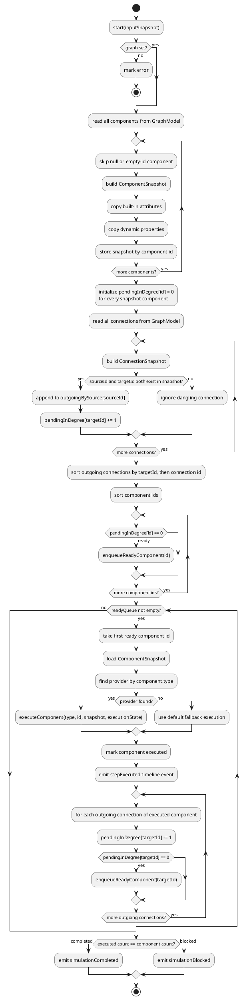

# component_map_editor

A reusable Qt/QML module (ComponentMapEditor) for building interactive graph or component-map editors.
The module exposes C++ models, services, and commands together with ready-made QML components.

## Project structure

component_map_editor/
- models/
  - ComponentModel: QML element for a graph component (id, label, x, y, color, type)
  - ConnectionModel: QML element for a directed connection (id, sourceId, targetId, label)
  - GraphModel: QML element holding component + connection lists and CRUD methods
- services/
  - ValidationService: validates graph integrity
  - ExportService: JSON serialization/deserialization
- ui/
  - GraphCanvas.qml: interactive canvas (grid, draggable components, connection rendering)
  - ComponentItem.qml: draggable component card delegate
  - Connection.qml: directed-connection Shape component
  - Palette.qml: sidebar for adding new component types
  - PropertyPanel.qml: inspector panel for selected component/connection
- commands/
  - UndoStack: custom undo/redo stack (no Qt Widgets dependency)
  - GraphCommands: GraphCommand subclasses (Add/Remove/Move component & connection)

example/
- standalone demo application

## Requirements

- Qt: 6.5+
- CMake: 3.21+
- C++: 17

## Build

cmake -B build -DCMAKE_PREFIX_PATH=/path/to/Qt6
cmake --build build

The example application is built as build/example/example_app.

## Routing Verification

Use the verification checklist in [manual-check/orthogonal_routing_verification.md](manual-check/orthogonal_routing_verification.md)
for Stage 1 + Stage 2 orthogonal router acceptance (unit checks, integration checks,
and benchmark performance gates).

## QML API summary

- ComponentModel: id, label, x, y, color, type
- ConnectionModel: id, sourceId, targetId, label
- GraphModel: components, connections, addComponent(), removeComponent(), addConnection(), removeConnection(), componentById(), connectionById(), clear()
- ValidationService: validate(graph), validationErrors(graph), validationIssues(graph)
- ExportService: exportToJson(graph), importFromJson(graph, json)
- UndoStack: canUndo, canRedo, undoText, redoText, undo(), redo(), clear()
- GraphCanvas: graph, undoStack, selectedComponent, selectedConnection
- ComponentItem: component, selected, undoStack
- Connection: connection, sourceX/Y, targetX/Y, selected
- Palette: graph, undoStack
- PropertyPanel: component, connection

## GraphExecutionSandbox behavior

GraphExecutionSandbox is a deterministic runtime simulator for a GraphModel.
It does not mutate the graph structure itself. Instead, it snapshots the graph,
executes component-by-component, and produces runtime outputs such as
timeline events, executionState, componentState, and status.

### How it finds the correct workflow to run

The sandbox resolves the workflow in two layers:

- Layer 1: detect executable order from the connection graph.
- Layer 2: execute each ready component using the provider registered for that component type.

The important point is that GraphExecutionSandbox does not try to infer workflow from labels,
UI position, or component titles. It derives workflow only from:

- component ids and types
- connection sourceId -> targetId relationships
- registered execution semantics providers

1. Execution order (which component runs next)
- On start(), the sandbox first snapshots every valid component into `m_componentsById`.
- It then initializes `m_pendingInDegree` for every snapshotted component to `0`.
- Next, it scans every connection and treats it as a dependency edge:
  `sourceId -> targetId`.
- If either endpoint is missing from the component snapshot, that connection is ignored.
- For each valid connection:
  - it is stored in `m_outgoingBySource[sourceId]`
  - `m_pendingInDegree[targetId]` is incremented
- After scanning all connections, any component with `pendingInDegree == 0` is an entry point.
- Those entry points are inserted into the ready queue in sorted id order.
- Each execution step removes the first ready component, executes it, then walks all of its
  outgoing connections.
- Every outgoing connection reduces the target component's pending in-degree by `1`.
- A target becomes runnable only when all of its incoming dependencies have been satisfied,
  meaning its pending in-degree reaches `0`.
- This is effectively a deterministic topological traversal of the component graph.
- If the ready queue becomes empty before all components are executed, the remaining graph is
  treated as blocked. In practice this means a cycle, a dead dependency chain, or an invalid
  graph shape that never exposes another zero-in-degree component.

2. Execution semantics (how a component is executed)
- Providers are registered by supported component type.
- Internally, the sandbox builds a map: componentType -> provider.
- When a component is dequeued, it looks up provider by component.type.
- If found, executeComponent(...) is called with:
  - component snapshot attributes
  - current executionState input
  - outputState and trace outputs
- If no provider is registered for that type, a default fallback path is used
  (adds trace note and updates lastExecutedComponentId).
- Connection labels do not choose the provider. Provider selection is based on
  component.type, while connections only control execution readiness/order.

### Practical example

For a graph like this:

- `InputA -> Add1`
- `InputB -> Add1`
- `Add1 -> Output1`

the sandbox detects the workflow as:

1. `InputA` and `InputB` start with in-degree `0`, so both are ready immediately.
2. `Add1` starts with in-degree `2`, so it cannot run yet.
3. After `InputA` executes, `Add1` drops to in-degree `1`.
4. After `InputB` executes, `Add1` drops to in-degree `0` and becomes ready.
5. After `Add1` executes, `Output1` drops to in-degree `0` and becomes ready.

So the sandbox finds workflow order from dependency satisfaction, not from a hard-coded
workflow definition file.

This means "correct workflow" is selected by both data dependencies
(connection topology) and type-specific semantics providers.

### Determinism and debugging

- Ready queue insertion is id-sorted, so same graph + same providers produce
  stable execution order.
- Breakpoints can pause before a specific component id executes.
- run(maxSteps) allows bounded execution for inspection and tests.
- Timeline events include simulationStarted, stepExecuted, breakpointHit,
  simulationCompleted, simulationBlocked, and error.

## Validation Architecture

ValidationService is provider-backed.

- ValidationService itself is an orchestrator that builds a graph snapshot and forwards
  it to registered IValidationProvider implementations.
- If no validation providers are configured, a non-null graph is treated as valid by default.
- validate(graph) returns false only when at least one provider issue has severity "error"
  (or an empty severity).

ValidationService API:

- validate(graph): boolean pass/fail for error-level issues
- validationErrors(graph): QStringList flattened from error-level issue messages
- validationIssues(graph): raw provider issue objects (QVariantList of QVariantMap)

Use validationIssues(graph) when UI needs to distinguish warnings from errors.

## Naming note

- The project intentionally avoids creating a QML type named Component because QtQuick already provides a built-in Component type.
- The visual delegate is named ComponentItem to avoid ambiguity, while model naming uses ComponentModel.

## License

MIT
