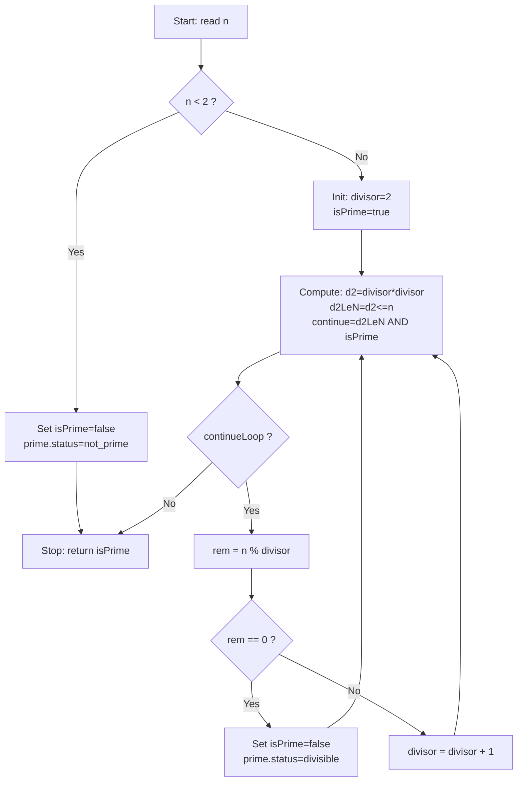

# Prime Check Workflow: Start → Stop

Feature goal:
- **Start** receives integer `n`.
- **Stop** returns key `isPrime` (bool) and `prime.status` (string).

---

## Context Contract

| Direction | Key | Type | Description |
|---|---|---|---|
| Input | `n` | int | The number to test. |
| Output | `isPrime` | bool | `true` if `n` is prime. |
| Output | `prime.status` | string | `prime`, `not_prime`, or `divisible`. |

---

## Graph (High Level)

---

## Required Component Types

Every component below must exist in the extension pack before this workflow can execute.

### Already Implemented

| Type ID | Category | Key Properties | Role in Prime Graph |
|---|---|---|---|
| `start` | control | `inputNumber` | Entry point, seeds `n` into context. |
| `stop` | control | — | Exit point, reads final `isPrime`. |
| `math/add` | math | `inputAKey`, `inputBKey`, `outputKey` | Increment divisor: `divisor + 1`. |
| `math/multiply` | math | `inputAKey`, `inputBKey`, `outputKey` | Compute `d2 = divisor * divisor`. |
| `control/loop` | control | `iterKey`, `maxIterKey`, `continueKey`, `conditionKey` | Guard iteration budget; write `continueLoop`. |
| `control/ifelse` | control | `conditionKey`, `trueRouteKey`, `falseRouteKey` | Branch on `n < 2`, `continueLoop`, and `rem == 0`. |
| `system/error_handler` | system | `errorKey`, `message` | Catch any unexpected execution error. |

### Must Implement Next

| Type ID | Category | Key Properties | Role in Prime Graph |
|---|---|---|---|
| `math/mod` | math | `inputAKey` (`n`), `inputBKey` (`divisor`), `outputKey` (`rem`), `errorKey` | Compute remainder: `rem = n % divisor`. |
| `math/less_than` | math | `inputAKey` (`n`), `inputBKey` (`2`), `outputKey` (`nLt2`), `errorKey` | Guard: is `n < 2`? |
| `math/less_or_equal` | math | `inputAKey` (`d2`), `inputBKey` (`n`), `outputKey` (`d2LeN`), `errorKey` | Loop condition: is `d2 <= n`? |
| `math/equal` | math | `inputAKey` (`rem`), `inputBKey` (`0`), `outputKey` (`isDivisible`), `errorKey` | Test: is `rem == 0`? |
| `logic/and` | logic | `inputAKey` (`d2LeN`), `inputBKey` (`isPrime`), `outputKey` (`continueCandidate`), `errorKey` | Combine loop condition: `d2LeN AND isPrime`. |
| `context/set` | context | `key`, `value` | Write constant values back to context (e.g. `isPrime=false`). |

> Implementation checklist for each new type follows the standard 4-file pattern:
> 1. Declare type ID in `customizecomponenttypeprovider.h`.
> 2. Add descriptor + defaults in `customizecomponenttypeprovider.cpp`.
> 3. Add inspector schema target in `customizepropertyschemaprovider.cpp`.
> 4. Add execution branch in `customizeexecutionsanticsprovider.cpp`.

---

## Node-by-Node Build Steps

| Step | Node ID | Type | Property Panel Configuration | Reads from Context | Writes to Context |
|---|---|---|---|---|---|
| 1 | `start` | `start` | `inputNumber = n` | — | `n` |
| 2 | `check_lt2` | `math/less_than` | `inputAKey=n`, `inputBKey=__two__`, `outputKey=nLt2` | `n` | `nLt2` |
| 3 | `branch_small` | `control/ifelse` | `conditionKey=nLt2`, `trueRouteKey=routeSmall`, `falseRouteKey=routeCandidate` | `nLt2` | `routeSmall`, `routeCandidate` |
| 4a | `set_not_prime_small` | `context/set` | `key=isPrime`, `value=false` | `routeSmall` | `isPrime` |
| 4b | `init_divisor` | `context/set` | `key=divisor`, `value=2` | `routeCandidate` | `divisor=2`, `isPrime=true` |
| 5 | `compute_d2` | `math/multiply` | `inputAKey=divisor`, `inputBKey=divisor`, `outputKey=d2` | `divisor` | `d2` |
| 6 | `compute_d2leN` | `math/less_or_equal` | `inputAKey=d2`, `inputBKey=n`, `outputKey=d2LeN` | `d2`, `n` | `d2LeN` |
| 7 | `combine_cond` | `logic/and` | `inputAKey=d2LeN`, `inputBKey=isPrime`, `outputKey=continueCandidate` | `d2LeN`, `isPrime` | `continueCandidate` |
| 8 | `loop_guard` | `control/loop` | `conditionKey=continueCandidate`, `continueKey=continueLoop`, `maxIterKey=maxIter` | `continueCandidate`, `iter`, `maxIter` | `continueLoop`, `iter` |
| 9 | `branch_continue` | `control/ifelse` | `conditionKey=continueLoop`, `trueRouteKey=routeBody`, `falseRouteKey=routeDone` | `continueLoop` | `routeBody`, `routeDone` |
| 10 | `compute_rem` | `math/mod` | `inputAKey=n`, `inputBKey=divisor`, `outputKey=rem` | `n`, `divisor` | `rem` |
| 11 | `check_divisible` | `math/equal` | `inputAKey=rem`, `inputBKey=__zero__`, `outputKey=isDivisible` | `rem` | `isDivisible` |
| 12 | `branch_div` | `control/ifelse` | `conditionKey=isDivisible`, `trueRouteKey=routeDivisible`, `falseRouteKey=routeNotDiv` | `isDivisible` | `routeDivisible`, `routeNotDiv` |
| 13a | `set_not_prime_div` | `context/set` | `key=isPrime`, `value=false` | `routeDivisible` | `isPrime=false` |
| 13b | `inc_divisor` | `math/add` | `inputAKey=divisor`, `inputBKey=__one__`, `outputKey=divisor` | `divisor` | `divisor` |
| 14 | ← back-edge to step 5 | — | — | — | — |
| 15 | `stop` | `stop` | — | `isPrime` | final output |

> `__two__`, `__zero__`, `__one__` are constant context keys seeded at init with values 2, 0, 1.
> Alternative: use fallback snapshot value fields in `math/less_than`, `math/equal`, `math/add`.

---

## Connections (Edge List)

| # | From Node | To Node | Condition / Route Key |
|---|---|---|---|
| E01 | `start` | `check_lt2` | unconditional |
| E02 | `check_lt2` | `branch_small` | unconditional |
| E03 | `branch_small` | `set_not_prime_small` | `routeSmall=true` |
| E04 | `branch_small` | `init_divisor` | `routeCandidate=true` |
| E05 | `set_not_prime_small` | `stop` | unconditional |
| E06 | `init_divisor` | `compute_d2` | unconditional |
| E07 | `compute_d2` | `compute_d2leN` | unconditional |
| E08 | `compute_d2leN` | `combine_cond` | unconditional |
| E09 | `combine_cond` | `loop_guard` | unconditional |
| E10 | `loop_guard` | `branch_continue` | unconditional |
| E11 | `branch_continue` | `stop` | `routeDone=true` |
| E12 | `branch_continue` | `compute_rem` | `routeBody=true` |
| E13 | `compute_rem` | `check_divisible` | unconditional |
| E14 | `check_divisible` | `branch_div` | unconditional |
| E15 | `branch_div` | `set_not_prime_div` | `routeDivisible=true` |
| E16 | `branch_div` | `inc_divisor` | `routeNotDiv=true` |
| E17 | `set_not_prime_div` | `compute_d2` | back-edge (next iteration) |
| E18 | `inc_divisor` | `compute_d2` | back-edge (next iteration) |

---

## Manual QA Matrix (Prime Check)

| ID | Input | Property Panel | Expected `isPrime` | Expected `prime.status` | Pass/Fail |
|---|---|---|---|---|---|
| P01 | `n=2` | `maxIter=100` | `true` | `prime` | |
| P02 | `n=3` | `maxIter=100` | `true` | `prime` | |
| P03 | `n=4` | `maxIter=100` | `false` | `divisible` | |
| P04 | `n=17` | `maxIter=100` | `true` | `prime` | |
| P05 | `n=18` | `maxIter=100` | `false` | `divisible` | |
| P06 | `n=1` | `maxIter=100` | `false` | `not_prime` | |
| P07 | `n=0` | `maxIter=100` | `false` | `not_prime` | |
| P08 | `n=-5` | `maxIter=100` | `false` | `not_prime` | |
| P09 | `n=97` | `maxIter=200` | `true` | `prime` | |
| P10 | `n=100` | `maxIter=200` | `false` | `divisible` | |

---

## Source Files to Change

| File | Change |
|---|---|
| `customizecomponenttypeprovider.h` | Add type IDs for `math/mod`, `math/less_than`, `math/less_or_equal`, `math/equal`, `logic/and`, `context/set`. |
| `customizecomponenttypeprovider.cpp` | Add descriptors + defaults for each new type. |
| `customizepropertyschemaprovider.cpp` | Add schema targets: `component/math/mod`, `component/math/less_than`, etc. |
| `customizeexecutionsanticsprovider.h` | Declare new type ID constants. |
| `customizeexecutionsanticsprovider.cpp` | Add execution branches; `math/mod` can reuse `executeBinary` pattern with `std::fmod`. |
| `tests/tst_CustomizeExampleMathWorkflows.cpp` | Add unit tests for each new helper type before wiring the prime graph. |
