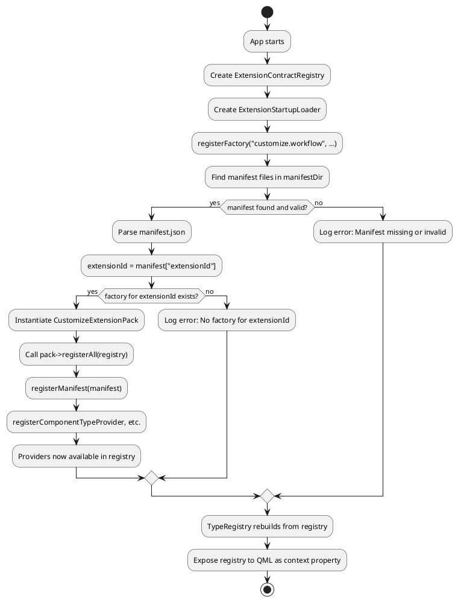

# Customize Example

Step-by-step workflow guideline:
- [WORKFLOW_GUIDELINE_NEWTON_QUARTIC.md](WORKFLOW_GUIDELINE_NEWTON_QUARTIC.md)

## Intergrating Step
### Load custom component types

```plantuml
    @startuml
    start

    :App starts;
    :Create ExtensionContractRegistry;
    :Create ExtensionStartupLoader;

    :registerFactory("customize.workflow", ...);

    :Find manifest files in manifestDir;
    if (manifest found and valid?) then (yes)
    :Parse manifest.json;
    :extensionId = manifest["extensionId"];
    if (factory for extensionId exists?) then (yes)
        :Instantiate CustomizeExtensionPack;
        :Call pack->registerAll(registry);
        :registerManifest(manifest);
        :registerComponentTypeProvider, etc.;
        :Providers now available in registry;
    else (no)
        :Log error: No factory for extensionId;
    endif
    else (no)
    :Log error: Manifest missing or invalid;
    endif

    :TypeRegistry rebuilds from registry;
    :Expose registry to QML as context property;
    stop
    @enduml
```